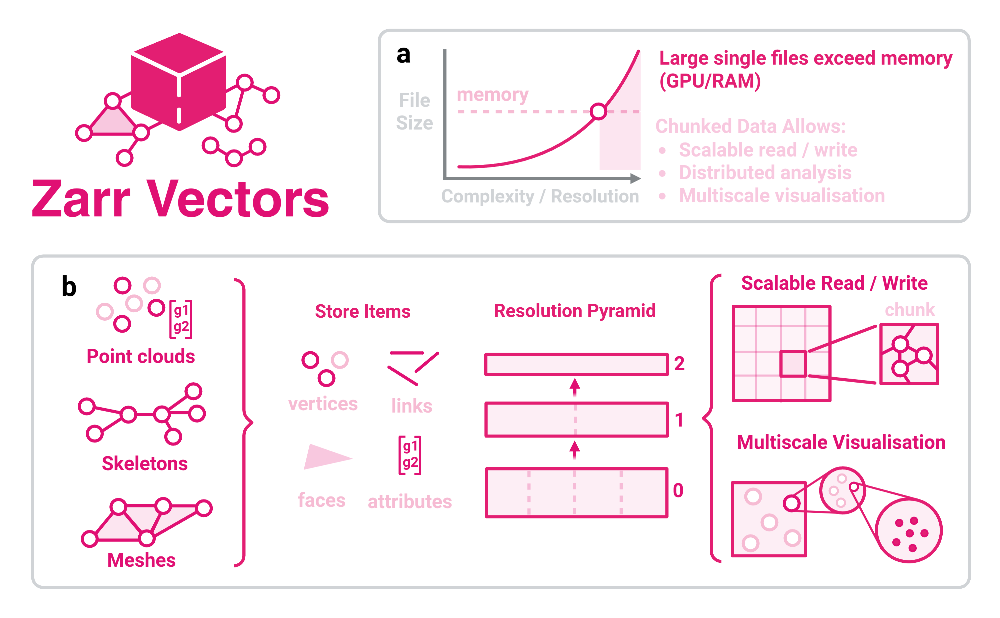

.. zarr-vectors documentation master file

.. image:: zarr-vectors.png
   :width: 55%
   :align: center
   :alt: zarr-vectors

----

**zarr-vectors** stores three-dimensional spatial geometry — point clouds,
streamlines, graphs, skeletons, and meshes — in spatially indexed Zarr v3
stores. Spatial queries touch only the chunks they need, whether the store
sits on a local filesystem or a cloud object store (S3, GCS). Resolution
pyramids are encoded natively so viewers like Neuroglancer can stream data
progressively at any scale.

The library implements `Zarr Vectors
<https://github.com/AllenInstitute/zarr_vectors>`_, originally specified by
Forest Collman at the Allen Institute for Brain Sciences, extended with
separated chunk/bin sizes, per-level sparsity, and OME-Zarr-compatible
multiscale metadata.

Two module surfaces carry a compatibility promise, split by what the caller is
doing. ``zarr_vectors.api`` is for **using** data — opening a store, selecting
a region or a set of objects, reading it back, editing it — and is re-exported
from the top-level package, so ``zarr_vectors.open(...)`` and
``zarr_vectors.api.open(...)`` are the same function. ``zarr_vectors.building``
is for **making** stores: ingest converters, pyramid builders, exporters,
repair tools. Everything else — ``core``, ``encoding``, ``spatial``, ``lazy``,
``ops``, ``sharding``, ``multiresolution`` and ``rechunk`` — is internal and
changes without notice. :func:`zarr_vectors.stability` answers for any dotted
name at runtime, so nothing here has to be taken on trust.

         complexity, crossing the memory ceiling. Panel b shows point clouds,
         skeletons and meshes decomposed into vertices, links, faces and
         attributes, stacked into a resolution pyramid that supports scalable
         read/write and multiscale visualisation.
   :figclass: zv-figure

   **Overview of Zarr Vectors.**
   **a** — Complex and detailed derivative datasets now exceed GPU and system
   memory. **b** — Summary of the Zarr Vectors concept, showing input data
   types, construction, and uses.

.. raw:: html

   

     <iframe src="explainer.html" class="zv-explainer-frame"
             frameborder="0" allowfullscreen></iframe>
   

----

| `Link to the GitHub repository <https://github.com/BRIDGE-Neuroscience/zarr-vectors-py>`__

Where to start
--------------

.. list-table::
   :widths: 35 65

   * - :doc:`getting_started/quickstart`
     - Write and query your first vector store in a few lines of Python.
   * - :doc:`getting_started/concepts`
     - The mental model: chunks, supervoxel bins, fragments, the object model
       and the resolution pyramid — and how ``Layout`` sets them.
   * - :doc:`api/api`
     - The data surface: ``open``, ``Schema``, ``select``, ``ReadResult``,
       resolution levels and objects.
   * - :doc:`api/building`
     - The builder surface, for code that writes stores rather than reads
       them: arrays, fragments, shards and manifests.
   * - :doc:`api/index`
     - Which modules are supported, which are internal, and how to ask at
       runtime.
   * - :doc:`spec/index`
     - Full technical specification for Zarr Vectors.

.. toctree::
   :maxdepth: 1
   :caption: Getting Started
   :hidden:

   getting_started/installation
   getting_started/quickstart
   getting_started/concepts
   getting_started/faq

.. toctree::
   :maxdepth: 1
   :caption: Specification
   :hidden:

   spec/index

.. toctree::
   :maxdepth: 1
   :caption: Tutorials
   :hidden:

   tutorials/data_types/point_clouds
   tutorials/data_types/polylines_streamlines
   tutorials/data_types/graphs_skeletons
   tutorials/data_types/meshes
   tutorials/multiscale/building_pyramids
   tutorials/multiscale/lazy_loading
   tutorials/io/cloud_stores
   tutorials/io/validation_and_repair
   tutorials/neuroglancer/overview
   tutorials/neuroglancer/zv_ngtools_install
   tutorials/neuroglancer/local_viewer
   tutorials/neuroglancer/shell_console
   tutorials/neuroglancer/layer_api

.. toctree::
   :maxdepth: 1
   :caption: API Reference
   :hidden:

   api/index

.. toctree::
   :maxdepth: 1
   :caption: How-To Guides
   :hidden:

   how_to/choose_chunk_and_bin
   how_to/memory_efficient_writes
   how_to/hpc_pipelines
   how_to/cite

.. toctree::
   :maxdepth: 1
   :caption: Benchmarks
   :hidden:

   benchmarks/index
